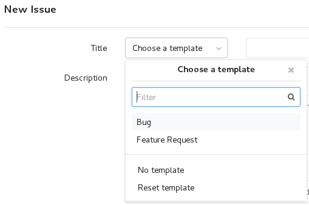

Contributing
============

Contributions are welcome. You can help in any way you want, for instance by
opening issues on the `bug tracker
<https://git.ziirish.me/ziirish/burp-ui/issues>`__, sending patches, etc.

There is also a dedicated website. Currently it only hosts a `Discourse
<http://www.discourse.org/>`__ instance where you can discuss with each other.
No need to create another account, the one you use in the `bug tracker
<https://git.ziirish.me/ziirish/burp-ui/issues>`__ can be imported
automatically!

Feel free to use it and post your tips and remarks.

The address is: `https://forum.burp-ui.org/ <https://forum.burp-ui.org/>`__

You can financially support the project if you find it useful or if you would
like to sponsor a feature. Details on my `website <https://ziirish.info/>`__.

Translating
-----------

Translations are very welcome!
If you are willing to help, you will need some tools:

::

    pip install Flask-Babel

Then you need to fork the project retrieve the sources:

::

    git clone https://git.ziirish.me/<your_login>/burp-ui.git
    cd burp-ui
    git submodule update --init
    pip install -r requirements.txt

You can have the list of available languages by running:

::

    ls burpui/translations

New language
^^^^^^^^^^^^

If your language is not listed, you can create a new translation running the
following command:

::

    ./tools/bui-manage init_translation <country_code> # where <country_code> can be "de", "ru", etc.

Update translation
^^^^^^^^^^^^^^^^^^

If you want to update an existing (and/or un-complete) translation, you probably
want to have a look at the *templates* files.

An un-translated file will contain things like:

::

    <h1>Some title</h1>

The string *Some title* won't be translated as is.
You need to update the template like this:

::

    <h1>{{ _('Some title') }}</h1>

Then you can update the translation files with the following command:

::

    ./tools/bui-manage update_translation

Translation
^^^^^^^^^^^

Now you can proceed the translation in the file
*burpui/translations/<country_code>/LC_MESSAGES/messages.po*.

It looks like:

::

    #: burpui/forms.py:18 burpui/templates/login.html:8
    msgid "Username"
    msgstr ""

You just have to put the translations in the *msgstr* line like:

::

    #: burpui/forms.py:18 burpui/templates/login.html:8
    msgid "Username"
    msgstr "Utilisateur"

Once it's done, you can push the sources and create a Merge Request on GitLab:

::

    git checkout -b translation-<country_code>
    git add burpui/translations/<country_code>/LC_MESSAGES/messages.po
    git commit -m "<country_code> translation"
    git push -u origin translation-<country_code>

Issues / Bugs
-------------

If you find any issue while using ``Burp-UI`` please report it on the `bug
tracker <https://git.ziirish.me/ziirish/burp-ui/issues>`__.
All issues should contain the used command line to reproduce the problem, the
debug output and both versions of burp and ``Burp-UI`` you are using.

A Bug Report template is available directly in the Issue Tracker:

The template illustrate the commands to run in order to provide as much details
as you can in order to help reproduce the issue.

Any un-complete bug report will likely be **ignored**.

If you are running ``Burp-UI`` <= *v0.5.0*, you can get those informations using
the following commands:

::

        $ /usr/sbin/burp -v
        burp-1.4.40
        $ burp-ui -V -v
        burp-ui: v0.1.0.dev (90deb82c7b0be35f1a70bb073c9926b5947c6a85)
        $ burp-ui -v

Optionally your python version and your OS might be useful as well.

Questions
---------

Ask questions in the `discussion forum <https://forum.burp-ui.org/>`__. Do not
use the issue tracker for this purpose.

You can also join the ``#burp-ui`` room on irc.freenode.org.

``Burp-UI`` has extensive online documentation please read the `doc
<https://burp-ui.readthedocs.io/en/latest/>`__.

Troubleshooting
---------------

In case you encounter troubles with ``Burp-UI``, you should run it with the
``-vvvv`` flag and paste the relevant output within your bug-report.
Please also give the version of ``burp`` **AND** ``Burp-UI``.
Since *v0.0.6* you can use the ``-V`` or ``--version`` flag in order to get your
version number.

Merge / Pull requests
---------------------

I would like you to use `gitlab <https://git.ziirish.me/>`__ for your Merge
requests in order to take advantage of the automated tests I have been working
on.
You can login/register on my personal gitlab server with your github account.

Development
-----------

You will find any development information on the
`developer guide <developer.html>`_ page.
